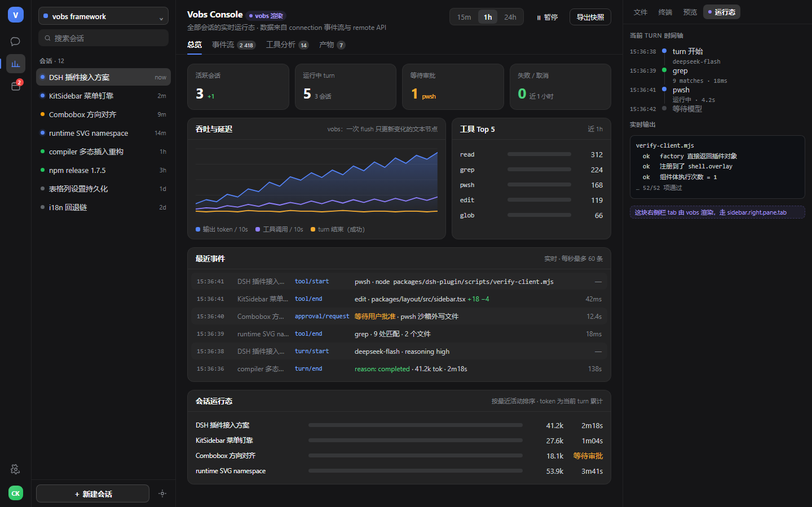
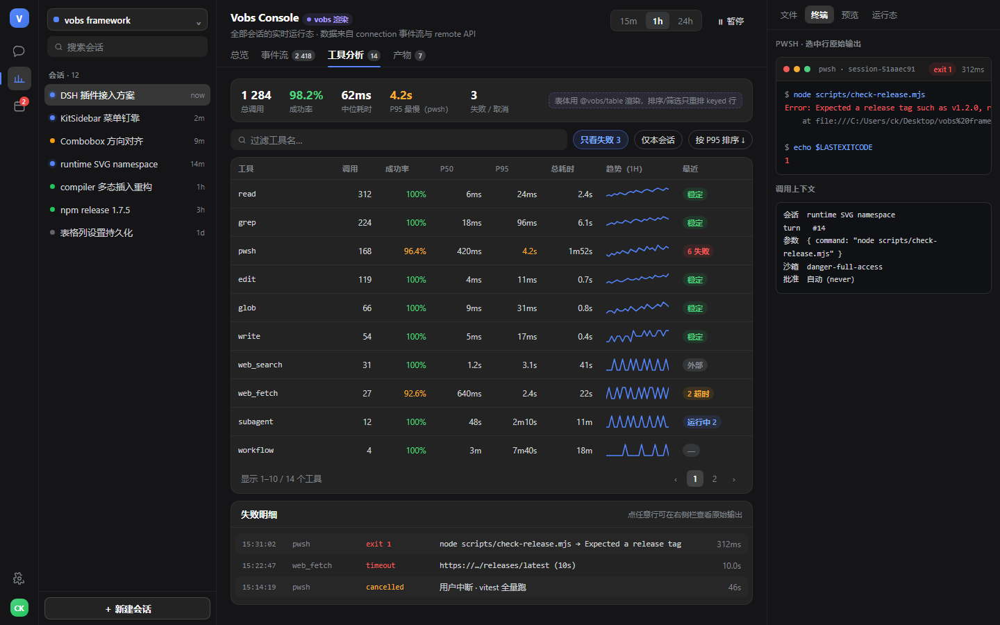
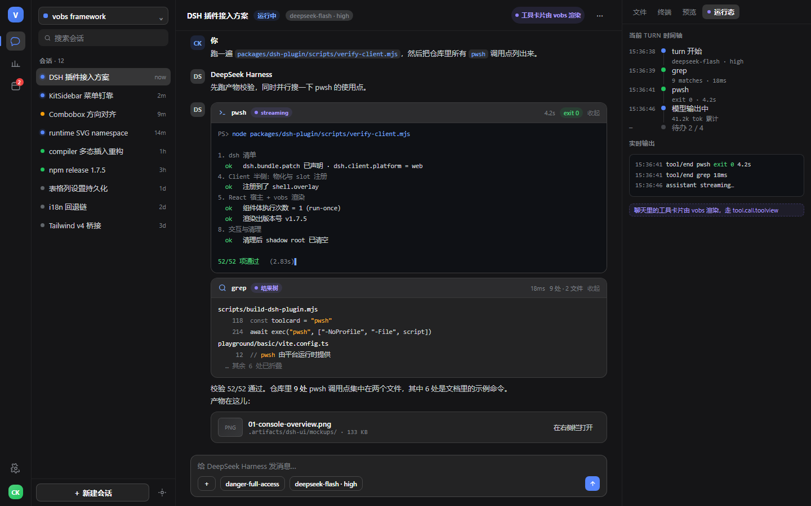

# Vobs for DSH —— UI 方案

> **实现现状（2026-02 更新）**
>
> 这份方案描述的三层落点已经落地：
>
> | 方案里的落点 | 实现位置 |
> | --- | --- |
> | ① Vobs Console（`main` keyed slot 整页 + 侧栏入口） | [`packages/dsh-console`](../../dsh-console) —— 四个 tab、62 项产物校验、35 项单测 |
> | ② 聊天内嵌工具渲染器（`tool.call.toolview`） | **未做**（P3，仍是方案） |
> | ③ 右侧栏「运行态」tab（`sidebar.right.pane.tab`） | **未做**（方案里把它当作 P0 最小闭环；实际先做了 Console） |
>
> 支撑它们的工具链 [`@vobs/dsh`](../../dsh) 与 [`vobs dsh` 命令组](../../cli) 已完整交付，
> 参考实现见 [`packages/dsh-plugin`](../../dsh-plugin)。
>
> **数据面现状**：Console 已接 DSH 真实的会话目录与运行状态（`sessions.list` + `uiSession.sessionStatus`），
> 事件流由状态跃迁派生。token、耗时与**工具级事件**不在会话目录里，界面如实显示「—」而不是编数据 ——
> 采集工具事件需要对每个会话 `retain()` 打开，DSH 自己刻意避免这么做，本实现同样不越这条线。
> 详见 [Console 的数据来源](../../dsh-console/README.md#数据来源)。

> 目标：用 vobs 给 DeepSeek Harness 做一套**真正有用**的 UI，而不是把 DSH 重画一遍。
> 状态：**方案，未编码**。预览图见 [`preview/`](preview)。





---

## 一、先划边界：插件能做到什么，做不到什么

这套结论来自对已安装 DSH（Desktop 0.1.x / `@deepseek-ai/cordis@4.0.4`）的实际检查，不是推测。

### 做不到

| 想法 | 为什么不行 |
| --- | --- |
| 替换 DSH 整个界面 / 换一套外壳 | 布局的 `root` slot 被 `@deepseek-ai/dsh-client-ui-layout` 的 `AppFrame` 独占注册（slot 声明即认领）。客户端插件拿不到 root，只能往它声明的子 slot 里加东西。换外壳＝改 DSH 源码，不是插件。 |
| 给 vobs 面板直接用 DSH 的 React 组件库 | `@deepseek-ai/dsh-client-ui-primitives` 是 React 组件。vobs 渲染的是真实 DOM，两套渲染器不能混用同一棵子树。视觉必须自建（用 DSH 的 design token 保持一致）。 |
| 复刻官方已有的面板 | `sidebar.right.pane.tab` 上已经有 文件 / 终端 / 浏览器 / 文档预览 / 交付物 / 计划 / 日程 / 子代理。重复做没有价值。 |

### 能做到（已核实的真实扩展点）

| Slot | 类型 | 能放什么 | 现在谁在用 |
| --- | --- | --- | --- |
| `main` | keyed | **整页主区域页面** | conversation、plugin-manager、schedule |
| `sidebar.panellist` | list | 主区域页面的左侧入口图标 | plugin-manager、schedule |
| `sidebar.right.pane.tab` + `.title` | list | 右侧栏新增 tab | files、terminal、browser、preview、deliverables、plan、schedule、subagent |
| `settings.section` | list | 独立设置页 | account、models、plugins、general、agent-preset |
| `tool.call.toolview` | list | **工具调用的自定义渲染器** | tool、skill、cordis、deliverables |
| `conversation.chat.node` | list | 聊天流里的自定义节点 | chat、goal、tool、user-questions、workflow-run |
| `conversation.chat.turnTail` | list | 每个 turn 末尾追加内容 | deliverables、plan、schedule |
| `shell.overlay` | list | 全局浮层 | 7 个插件在用 |

**注册一个整页页面的真实写法**（照 `dsh-client-ui-schedule` 的实际代码）：

```js
ctx.slots.inject('main', () => ctx.slots.register(
  { name: 'main', key: 'vobs-console', locale: NS, inject: () => ({ ... }) },
  ConsolePage,
))
ctx.slots.inject('sidebar.panellist', () => ctx.slots.register(
  { name: 'sidebar.panellist', id: 'vobs-console', order: 10, locale: NS, label: () => t('panel') },
  ConsoleIcon,
))
```

### 数据面（已核实）

- **客户端 cordis 服务**：`connection`、`remote`（`@deepseek-ai/dsh-api-gateway` 提供）、`sessions`、`locale`、`theme`、`layout`、`resources`、`modules`、`sidebarRightTabs`、`documentPreviews`、`uiRenderer`、`slots`、`conversation`、`uiConversation`、`shortcuts`…
- **Host 侧 API**：`api-session-controller`、`api-job-controller`、`api-terminal-controller`、`api-workspace-files`、`api-settings-controller`、`api-account-controller` —— 经 typert 由 `remote` 暴露给浏览器。
- **关键能力**：`remote` 带 `RemoteEvents` 与 `remote-stream`，即 **Host→Client 推送流**。实时总览靠它，不用轮询。
- **拿不到的数据**：Host 没暴露的聚合量（例如跨会话 token 汇总），在**我们自己的 Host 半侧**加服务算——这部分完全可控。

---

## 二、为什么是 vobs，而不是用 React 再写一遍

不是"因为 vobs 是我写的"，而是**目标 UI 的负载特征刚好是 vobs 的强项**：

| 目标场景 | React 的代价 | vobs 的做法 |
| --- | --- | --- |
| 每秒几十~几百条的事件流 | 每次 setState 触发组件树 diff | 每条事件是一个 signal 写入，只有绑定的那个文本节点/新增行被改 |
| 几千行日志的追加 | 长列表 reconciliation | `insertList` keyed 复用，只插入新增行 |
| 表格排序/筛选 | 整表重渲染 | keyed 行重排 + 单元格独立 binding |
| 面板自身 | 组件体每次更新重跑 | **组件体只跑一次**，更新全部在 effect 里 |

反过来说也要诚实：vobs 在 DSH 里**没有生态优势**——不能用 DSH 的 React 组件、不能复用官方样式。所以这套 UI 的价值必须靠"DSH 现在没有、且更新频繁"来立住，而不是靠"用 vobs 写的"。

---

## 三、旗舰：Vobs Console（主区域整页）

### 定位

DSH 现在是**单会话为中心**的：主区域是对话，右侧是当前会话的文件/终端/预览。**跨会话、跨 turn 的运行态**是散的——谁在跑、跑了多久、烧了多少 token、哪个工具在失败，得一个个会话点开看。

Vobs Console 补的就是这块：一个占满主区域的**多会话实时驾驶舱**。

### 页面结构（图 1、图 2）

顶部 4 张 KPI + 时间范围切换；四个 tab：

1. **总览** — 活跃会话 / 运行中 turn / 等待审批 / 失败；吞吐与延迟面积图；工具 Top5；最近事件；会话运行态（每会话 token/耗时进度）
2. **事件流** — 所有 session 的 `turn/start`、`turn/end`、`tool/*`、`approval/*` 按时间倒序，可暂停 / 过滤 / 搜索。**这是 vobs 的主场**：环形缓冲 + keyed 行，每秒几百条不掉帧
3. **工具分析** — `@vobs/table` 表格：工具 / 调用次数 / 成功率 / P50 / P95 / 总耗时 / 趋势 sparkline，可排序筛选；下方失败明细
4. **产物** — 本工作区交付物时间线，带缩略图与"在右侧栏打开"

### 为什么它值得做

- 多 Agent / 子代理一多，DSH 的侧边栏就不够看了；这块信息密度必须靠一整页
- 失败与审批是**最需要被看见**的两件事，现在埋在单个会话里
- 数据全是 Host 已有的（session 事件、tool 调用、token），不需要新埋点

---

## 四、第二落点：聊天的工具调用渲染器（图 3）

注册 `tool.call.toolview`，给最常用的几个工具做**结构化渲染**，替换掉现在的通用文本块：

| 工具 | 现在 | 做成 |
| --- | --- | --- |
| `pwsh` / `bash` | 纯文本 | 终端卡片：命令、流式 stdout、退出码、耗时、可折叠 |
| `edit` / `write` | 纯文本 | 真正的 diff 视图（+N −M，行内高亮） |
| `grep` / `glob` | 纯文本 | 结果树：文件 → 行号 → 命中高亮，可折叠 |
| `web_search` / `web_fetch` | 纯文本 | 来源卡片：favicon、标题、URL、摘要 |
| `subagent` / `workflow` | 纯文本 | 嵌套进度树，可展开看子代理轨迹 |

**这是性价比最高的一块**：改动小、天天看得见，而且流式输出正是 vobs 最擅长的负载。

---

## 五、第三、第四落点

**右侧栏「运行态」tab**（`sidebar.right.pane.tab` + `.title`）
当前 turn 的时间轴（工具调用序列 + 耗时）+ 实时日志尾巴。随手可看，不用切主区域。

**设置页**（`settings.section`）
面板开关、事件流缓冲上限、降采样阈值、配色跟随/自定义。

---

## 六、工程要点（决定成败的部分）

1. **事件风暴的内存**：事件流必须环形缓冲（建议默认 5000 条）+ 溢出降采样；暂停时停止入队而不是继续堆积。
2. **数据一致性**：客户端聚合的统计量（token、耗时）以 Host 为准，客户端只做展示与派生；有歧义就在 Host 半侧算。
3. **性能预算（可验收）**：
   - 5000 行事件流滚动保持 60fps
   - 每秒 200 条事件注入，单帧主线程占用 < 4ms
   - 表格排序 1000 行 < 16ms
   - 验收方式：在 `verify-client.mjs` 同款 jsdom/性能脚本里跑，和 React 基线对比 DOM 操作次数
4. **契约漂移**：slot 名与 remote API 是 DSH 内部契约。把当前用到的 slot / 服务名写进校验脚本做**契约断言**，DSH 升级后一跑就知道哪里断了。
5. **样式隔离**：每个 vobs 面板挂在自己的 shadow root 里，样式双向隔离；配色读 DSH 的 `--dsw-*` token（`body[data-ds-dark-theme]`），不另造一套设计语言。
6. **React 宿主**：每个 slot 需要一个极薄的 React 组件占位（`<div ref>` + `useEffect`），vobs 挂到这个元素的 shadow root 里。这是唯一必须碰 React 的地方。

---

## 七、分期

| 期 | 内容 | 工作量 | 验收 |
| --- | --- | --- | --- |
| **P0** | 右侧栏「运行态」tab：接 `connection` 事件流 + 环形缓冲 + 时间轴 | 0.5–1 天 | 真实 DSH 里能看见当前会话的实时工具时间轴 |
| **P1** | Console 骨架 + **总览** tab（KPI / 图表 / 会话运行态） | 2–3 天 | 主区域出现整页 Console，数据与 DSH 侧边栏一致 |
| **P2** | **事件流** tab + **工具分析** tab（`@vobs/table`） | 2–3 天 | 5000 行滚动不掉帧；排序筛选正确 |
| **P3** | `tool.call.toolview`：pwsh / grep / web_search 三个渲染器 | 2–3 天 | 聊天里工具卡片按类型结构化渲染 |
| **P4** | 设置页 + i18n + 性能压测报告 | 1–2 天 | 性能预算全部达标 |

建议 **P0 先做**：它是最小闭环，能最快验证"事件流 + 真实数据"这条路走得通，也是后面所有东西的地基。

---

## 八、风险与不做的事

**风险**

- DSH 升级导致 slot / remote API 变化（用契约断言尽早发现）
- 视觉一致性是长期负担：自建组件库要跟着 DSH 的设计语言走
- 事件流在高并发下可能成为主线程瓶颈（先压测再谈功能扩展）
- 面板与官方 UI 并存时的层级/焦点冲突（shadow root + 只走官方 slot 可以规避大部分）

**不做**

- 不替换官方外壳、不修改 DSH 自身文件
- 不重复 files / terminal / browser / preview 这些官方已有的面板
- 不做"好看但没人看"的仪表盘——每个数字都要能对应一个行动

---

## 九、预览图说明

`preview/*.png` 是用 **DSH 真实 design token**（从已安装的 `@deepseek-ai/dsh-client-ui-theme` 提取的 `--dsw-*` 变量、字体栈、圆角）在 1440×900 下渲染的**静态示意图**：

- 外壳结构（左图标轨 / 会话侧栏 / 主区域 / 右侧栏）对应 layout 实际声明的 slot
- 面板内容是按本方案手绘的，**不是**真实运行截图
- 可编辑的 HTML 源在 `.artifacts/dsh-ui/mockups/`（本地脚手架，未入库；其中引用了 DSH 自身的样式表，不随本包分发）
