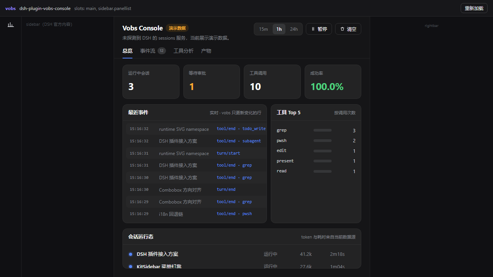

# @vobs/dsh

用 **vobs** 开发 **DeepSeek Harness（DSH）** 客户端插件的适配层。

它替插件作者处理掉 DSH 客户端插件里最容易踩坑、又跟业务毫无关系的三件事：

| 你要操心的事 | 以前 | 现在 |
| --- | --- | --- |
| 产物形态 | 自己把 CJS 包成 `window.__ModuleLoader__.load({id, factory})`，补 `module`/`exports` 垫片 | `dshBundle()` 自动完成 |
| 产物纯度 | 拆了 chunk、用了动态 `import()`，装进 DSH 才发现坏 | 构建期直接失败并说明原因 |
| React 宿主 | 每个 slot 手写 `<div ref>` + `useEffect` + shadow root + 清理 | `createVobsSlotHost` 一行 |
| slot 注册 | 手写 `ctx.slots.inject(...)` + `register(...)`，字段靠猜 | `defineDshOverlay` / `defineDshPanel` |
| 配色 | 自己判断 DSH 是深色还是浅色 | 宿主自动写 `data-scheme` |
| 类型 | `ctx: any` | 带完整类型的 `DshClientContext` |
| 本地开发 | 只能装进真实 DSH 才看得见 | `vobs dsh dev` + `@vobs/dsh/preview` |



*上图是一个外部插件项目跑 `vobs dsh dev` 的真实截图（1280×720，无头浏览器）。左轨道是 `sidebar.panellist` 入口，主区域是 `main` slot 里的整页面板。整个过程没有装进 DSH。*

---

## 30 秒上手

```bash
pnpm add -D @vobs/dsh @vobs/vobs @vobs/vite-plugin vite
```

**package.json** —— `dsh` 清单是 DSH 认出插件的唯一凭据：

```json
{
  "name": "my-dsh-plugin",
  "type": "module",
  "exports": {
    ".": "./lib/index.js",
    "./client": "./lib/client.js",
    "./cordis.patch.yml": "./cordis.patch.yml",
    "./package.json": "./package.json"
  },
  "dsh": {
    "manifestVersion": 1,
    "bundle": { "patch": "./cordis.patch.yml" },
    "client": { "platform": "web" }
  }
}
```

**cordis.patch.yml** —— 把自己的行插进 profile 的 cordis 树：

```yaml
- insert:
    - id: my-plugin
      name: my-dsh-plugin
```

**vite.config.ts** —— `dshBundle()` 负责产物形态：

```ts
import { defineConfig } from 'vite'
import { vobsPlugin } from '@vobs/vite-plugin'
import { dshBundle } from '@vobs/dsh/vite'

export default defineConfig({
  plugins: [
    vobsPlugin(),
    dshBundle({ entry: 'src/client/index.tsx' })
  ]
})
```

**src/client/index.tsx** —— 业务只剩「挂到哪」和「渲染什么」：

```tsx
import { defineDshOverlay } from '@vobs/dsh'
import { Panel } from './panel'

export default defineDshOverlay(
  { id: 'my-panel', order: 120, styles: PANEL_CSS },
  () => <Panel />
)
```

`pnpm vite build` 之后，`lib/client.js` 就是 DSH 能直接加载的 bundle。

---

## 三个注册器

### `defineDshOverlay(options, render)` —— 全局浮层

挂在 `shell.overlay`（DSH 自家的配额提示、插件管理器 toast 也在这里）。默认固定在窗口右下角。

```tsx
export default defineDshOverlay(
  { id: 'my-panel', order: 120, styles: css, label: '我的面板' },
  () => <Panel />
)
```

### `defineDshPanel(options, render)` —— 主区域整页

对应官方 `ui-schedule` 的注册方式：`main` 是 **keyed** slot，用 `key` 认领；`sidebar.panellist` 用同值做 `id` 关联，从而在左侧栏出现入口。

```tsx
export default defineDshPanel(
  {
    key: 'my-console',
    label: 'My Console',
    sidebarEntry: {
      label: 'Console',
      renderIcon: () => <ConsoleIcon />
    }
  },
  () => <Console />
)
```

### `defineDshPlugin(spec)` —— 逃生口

需要自己写 `apply`、注册到适配层还没封装的 slot 时用：

```tsx
import { defineDshPlugin } from '@vobs/dsh'

export default defineDshPlugin({
  inject: ['connection', 'remote'],
  setup(ctx) {
    const connection = ctx.get('connection')
    // …自己的接线…
    return () => { /* 销毁时执行 */ }
  }
})
```

未覆盖的 slot 直接用底层 API 也一样安全：

```tsx
ctx.slots.inject('sidebar.right.pane.tab', () =>
  ctx.slots.register({ name: 'sidebar.right.pane.tab', key: 'my-tab' }, host)
)
```

---

## `dshBundle()` 做了什么

1. **包装产物** —— 把 rollup 的 CJS 输出包成一次 `window.__ModuleLoader__.load({ id, factory })` 注册，
   并注入 `module` / `exports` 垫片，让 CJS 产物原样运行；返回值优先取 `default` 导出。
2. **三条件白门禁**（违反即构建失败，且说明怎么改）：
   - 必须**只有一个 chunk** —— DSH 只支持自包含 chunk；
   - 不能有**独立 asset** —— CSS 要内联为字符串（例如注入 shadow root）；
   - 输出格式必须是 **cjs**。
3. **平台模块外置** —— `react` 强制 external（它是 DSH 平台模块表里的内置模块，
   打进产物会拿到第二份实例），并在 factory 首行注入 `globalThis.__VOBS_DSH_REACT__ = require('react')`。

选项：

| 选项 | 默认 | 说明 |
| --- | --- | --- |
| `id` | package.json 的 `name` | 浏览器模块身份 |
| `entry` | —— | 给了就顺手补 `build.lib`（cjs / 单文件） |
| `platformModules` | `['react']` | 额外需要外置的平台模块 |
| `fileName` | `client.js` | 产物文件名 |
| `react` | `true` | 设 `false` 关掉 React 引导注入（自己调 `useDshReact` 时） |

构建时还会检查 package.json 有没有 `dsh.client`，缺了会给出警告而不是等你装进 DSH 才发现。

---

## React 绑定

DSH 的 slot 只接受 React 组件；vobs 渲染的是真实 DOM。适配层的办法是：
**用一个极薄的 React 组件占一个元素，在该元素上开 shadow root，把 vobs 应用挂进去。**
React 侧永远只有这一个空壳，业务全在 vobs 里。

React 通过 `resolveDshReact()` 取用，两条路径：

1. `dshBundle()` 构建时自动注入（默认，无需写任何代码）；
2. 自建构建流程时手动 `useDshReact(require('react'))`。

两条都拿不到会抛出带修法的错误。

---

## DSH 契约速查

这些都是**从已安装的 DSH 反推出来的非官方契约**，DSH 升级后可能漂移。适配层因此只保证「声明保守」：
DSH 专有字段全部可选、未知字段原样透传。

| 位置 | 要求 |
| --- | --- |
| `package.json` → `dsh.bundle.patch` | patch 文件路径（相对包根） |
| `package.json` → `dsh.client.platform` | Web 客户端为 `'web'` |
| `package.json` → `dsh.client.inject/external/immediately` | 可选。`inject` 列需要先加载的客户端包；`external` 列平台表之外的模块请求 |
| `exports['.']` | Host 侧 cordis 插件模块（ESM，导出 `name` / `inject` / `apply`） |
| `exports['./client']` | 预构建的浏览器 bundle |
| 安装期脚本 | **不要**有 `prepare` / `postinstall`；产物必须已提交 |
| 依赖 | 尽量为零，且不要出现 `workspace:` 协议（Git 子目录直装时解析不了） |

常用 slot：

| slot | 形态 | 放什么 |
| --- | --- | --- |
| `main` | keyed | 主区域整页 |
| `sidebar.panellist` | list | 主区域页面的左侧入口 |
| `shell.overlay` | list | 全局浮层 |
| `sidebar.right.pane.tab` + `.title` | list | 右侧栏 tab |
| `settings.section` | list | 独立设置页 |
| `tool.call.toolview` | list | 工具调用的自定义渲染器 |
| `conversation.chat.node` / `.turnTail` | list | 聊天流内嵌节点 |

`single` 类型的 slot（`root` / `sidebar` / `rightbar` / `shell.leading`）已被官方占用，插件拿不到。

---

## 本地预览：`vobs dsh dev`

不用装进 DSH 就能看到面板。`vobs dsh dev` 会构建产物、起一个本地服务，并在浏览器里造一个仿 DSH 的外壳
（左轨道 / 侧栏 / 主区域 / 右栏 / 浮层），把插件注册的每个 slot 条目渲染到对应位置；改代码会自动重建并刷新。

```bash
vobs dsh init my-plugin     # 脚手架
cd my-plugin && pnpm install
pnpm dev                    # → http://127.0.0.1:5199/
```

底层是 `@vobs/dsh/preview`（也可以直接拿来用）：

```ts
import { startPreview, installLoaderShim } from '@vobs/dsh/preview'

installLoaderShim()                 // 装 window.__ModuleLoader__ 垫片
await loadYourBundleSomehow()       // 让产物执行一次，把 factory 注册进来
startPreview({
  container: document.getElementById('root')!,
  packageName: 'my-plugin',
  services: { sessions: fakeSessions }   // 可选：喂给 ctx.get()
})
```

它不模拟 DSH：不连后端、不实现 cordis、不还原官方组件样式，只回答「我的面板挂上去长什么样、会不会报错」。
为此它自带一份**极小的 React 实现**（只实现 `createElement` / `useRef` / `useEffect`），
因为适配层的宿主组件永远只用这三个 API。

页面加 `?static=1` 会关掉热刷新长连接，便于无头截图与 CI 断言。

## 命令行工具链

| 命令 | 作用 |
| --- | --- |
| `vobs dsh init [name]` | 脚手架出一个**独立**插件项目（不是 monorepo 子包），模板里已含清单、patch、vite 配置与 `.gitignore`（刻意不忽略 `lib/`） |
| `vobs dsh dev` | 上面的浏览器预览，监听重建 |
| `vobs dsh build` | 同时构建 **Client 与 Host 两半** —— 项目的 vite.config 只负责 Client |
| `vobs dsh check` | 装前一致性校验：清单字段、patch insert、安装期钩子、`workspace:` 协议、产物形态与纯度、`require` 是否只剩平台模块 |
| `vobs dsh install` | 组装安装 spec 并调用 `dsh plugin add`，顺手处理 pnpm 版本与 Windows 引号问题 |

## 本地校验

`@vobs/dsh` 不自带校验器；推荐的写法是像 `packages/dsh-plugin/scripts/verify-client.mjs` 那样，
用 jsdom 按 DSH 的模块协议真跑一遍产物：注册 factory → 物化取插件 → `apply()` → 挂载 → 断言 → 清理。

那是这份接线目前唯一的自动化验收手段 —— DSH 没有提供插件沙箱。

---

## 已知限制

- **非官方 API**：slot 名、`ctx` 服务、`dsh.client` 字段都是从已安装 DSH 反推的，没有官方类型也没有兼容承诺。
- **未覆盖全部 slot**：目前封装了 `shell.overlay` 与 `main` + `sidebar.panellist`；
  其余走 `defineDshPlugin` + 底层 `slots.register`。
- **视觉要自建**：vobs 面板里用不了 DSH 的 React 组件库（`@deepseek-ai/dsh-client-ui-primitives`）。
  一致性靠 DSH 的 `--dsw-*` design token 维持。
- **`react` 常驻 external**：即使插件完全不碰 React，构建产物也会带一行 `require('react')`（平台模块，零成本）。
